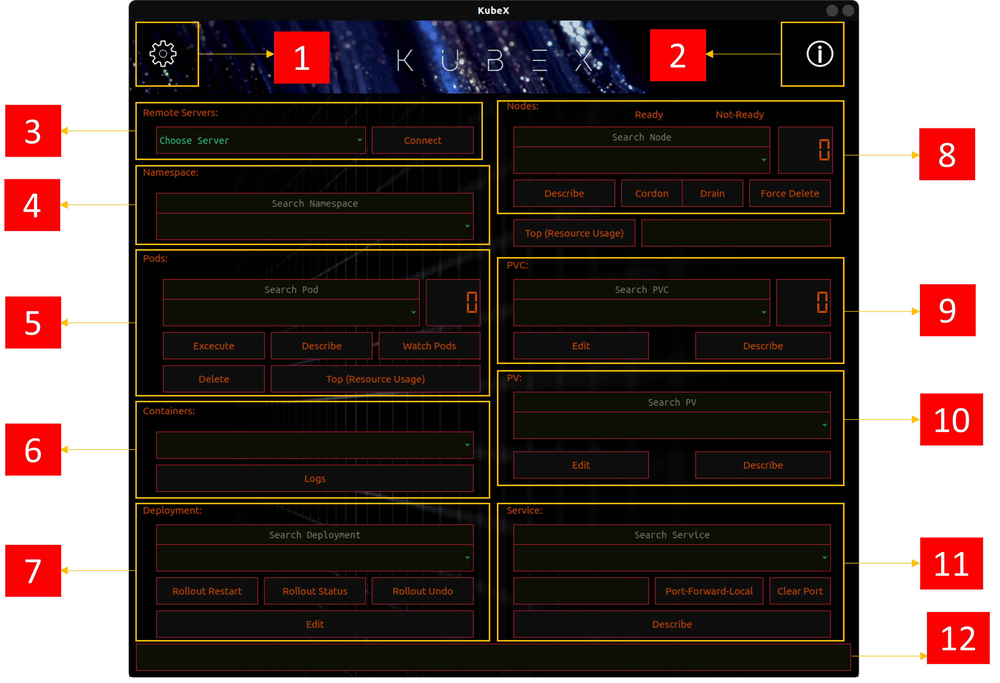

Building and Starting:
1.	Clone the repository in your local system.
2.	Cd kubex/
3.	Run ‘Docker build -t kubex .’
4.	Run the image using the following instructions for different os.
How to use it on Linux
Tested on Ubuntu 20.04
You can test if everything works with the small testing app included in this docker image. You can try it with:
docker run –name=kubex -it \
    -v /tmp/.X11-unix:/tmp/.X11-unix \
    -e DISPLAY=$DISPLAY \
    -u kubex \
    kubex python3 main.py
 
How to use it on MacOS
1.	Install XQuartz. Restart OS.
2.	In XQuartz: Check the option: XQuartz -> Preferences -> Security -> "Allow connections from network clients"
3.	Run in terminal:
IP=$(ifconfig en0 | grep inet | awk '$1=="inet" {print $2}')
xhost +
You can test if everything works with the small testing app included in this docker image. You can try it with:
docker run --rm -it \
    -v /tmp/.X11-unix:/tmp/.X11-unix \
    -e DISPLAY=$IP:0 \
    -u kubex \
    kubex python3 main.py

Note: The docker image can directly pulled from the docker hub repo:
docker pull sourishx/kubex

1.	 This is the settings button clicking on it you’ll get the settings window. Here you can add your server, where kubectl is configured, to which you can ssh into and also remove the added servers. You have to put the basic server details like server-ip, server-user, server-password.

Recommendation: First check the ssh connection to that remote server locally and also to connect to your local system use the wi-fi/ethernet adapter’s ip and also install or configure ssh-server on the system.

2.	This is the info button. Here, you’ll get the license and developer details.

3.	After adding the server, please select the server you want to connect to from the dropdown menu. And then hit the connect button.  A window will pop-up as long as the connection is made.

4.	Once connected to server, select the namespace. Use the namespace search bar to find your namespace easily.

5.	Next, select the pod to do operations. Use the execute to enter the selected pod’s bash shell or if the pod has multiple containers, then select the desired container and the hit execute to enter that particular container’s shell. 

You can use the search bar to find the pod easily as well as to filter the pods that you want to watch by hitting watch button afterwards, otherwise the watch button will show all the pods in that namespace. Top will show the selected pod’s all containers total resource usage. Delete will delete the selected pod safely. With ‘Describe’ you can see the pods description. The LCD display shows the total pod numbers in the selected namespace.

6.	Here you select the container, and also can see the pod or the selected container’s logs in multi-container scenario.

7.	Here you can select the Deployment and use the buttons accordingly. You can simply edit the selected deployment and save it to apply directly.

8.	Here you can access node related operations.

9.	Here you can select associated PVCs to your selected namespace. You can describe and edit the PVC as well.

10.	Here you can select associated PVs to your selected PVC. You can describe and edit the selected PV as well.

11.	Here you can select the service file and describe it. You can select a pod in the pod section and port forward the service to your local container. To access the service use the running docker application ip to the port 5000. For example: http://172.17.0.2:5000.

12.	This is the status bar.
